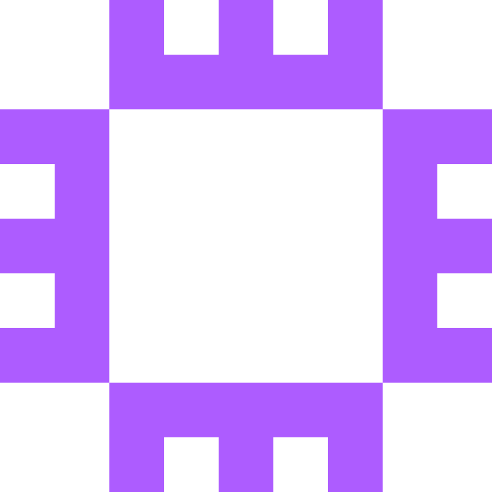

<div align="center">
  
  
  # AWS Student Builder Group — PIET
  ### Official Portal & AWS Student Community Day 2026 Platform

  [](https://nextjs.org/)
  [](https://www.typescriptlang.org/)
  [](https://tailwindcss.com/)
  [](https://www.framer.com/motion/)
  [](LICENSE)

  <p align="center">
    <strong>Panipat Institute of Engineering & Technology (PIET) · Panipat, Haryana (NCR)</strong><br />
    Official website for the AWS Student Builder Group (SBG) chapter and flagship portal for <strong>AWS Student Community Day (SCD) Panipat 2026</strong>.
  </p>

  <p align="center">
    <a href="https://aws-sbg-piet.co.in"><strong>Explore Live Site »</strong></a>
    ·
    <a href="#-features">Key Features</a>
    ·
    <a href="#-getting-started">Getting Started</a>
    ·
    <a href="#-environment-variables">Environment Setup</a>
  </p>
</div>

---

## 🌟 Overview

The **AWS Student Builder Group at PIET** is Haryana's premier student-led cloud computing community bridging academia with enterprise cloud engineering. This web application serves two distinct, unified experiences:

1. **AWS SBG Chapter Hub (`/`)**: Domain tracks (GenAI, DevOps, Architecture, Security), open-source cloud projects, student leadership, workshops, and regional chapter community links.
2. **AWS Student Community Day 2026 Flagship Summit (`/scd-panipat-2026`)**: Comprehensive summit portal featuring dynamic countdown HUD, keynote schedules, 6 technical tracks, interactive speaker CFPs, multi-tier sponsorship packages, and an **Interactive High-Resolution Delegate Badge Studio (`/scd-panipat-2026/badge`)**.

---

## 🚀 Key Features

### 🏛️ 1. Interactive Delegate Pass Studio (`/scd-panipat-2026/badge`)
- **Real-time HTML5 Canvas Graphics Engine**: Generates pixel-perfect `1200x1500px` conference credentials.
- **Cultural & Regional Panipat Watermark**: Features monumental Devanagari typography (`पानीपत`) and subtle AWS orbital architecture circuits.
- **Contextual Tech Track Icons**: 6 distinct summit tracks with matching glyphs:
  - ☁ `Student Cloud Builder`
  - ✦ `GenAI & Bedrock Specialist`
  - ◈ `Cloud Solutions Architect`
  - ⑂ `DevOps & Platform Engineer`
  - ⚡ `KIRO Buildathon Competitor`
  - ★ `Cloud Community Leader`
- **1-Click Direct LinkedIn Share**: Pre-populates a ready-to-post post on LinkedIn while automatically downloading the high-res PNG.

### ⚡ 2. Modern Design & Responsive UI
- **Turbopack & Tailwind CSS v4**: Ultra-fast hot reloading and zero-runtime CSS utility engine.
- **Tactile Phone UX**: Fluid bottom sheets, smooth mobile drawers, and phone-optimized layout.
- **Dark & Light Mode**: Seamless theme switching with persistent storage and system preference detection.
- **Subtle Motion & Depth**: Smooth parallax background, ambient glows, and Framer Motion micro-interactions.

### 📩 3. Automated Inquiries & Lead Capture (MailerLite API)
- **Live Support Chat Widget**: Native expandable drawer with FAQ chips and quick contact dispatch.
- **Sponsorship & Speaker CFP Portals**: Submissions automatically sync to **MailerLite** subscriber groups for instant community follow-ups.

---

## 🛠️ Tech Stack

- **Framework**: [Next.js 16 (App Router + Turbopack)](https://nextjs.org/)
- **Language**: [TypeScript](https://www.typescriptlang.org/)
- **Styling**: [Tailwind CSS v4](https://tailwindcss.com/)
- **Animation**: [Framer Motion](https://www.framer.com/motion/)
- **Icons**: [@hugeicons/react](https://hugeicons.com/)
- **Canvas Rendering**: Native HTML5 Canvas 2D Context (`CanvasRenderingContext2D`)
- **Email & CRM**: [MailerLite REST API](https://developers.mailerlite.com/)
- **Audio Synthesis**: Native Web Audio API (`AudioContext`)

---

## 📦 Getting Started

### Prerequisites

Ensure you have [Node.js](https://nodejs.org/) (v18.18 or higher) and `npm` installed.

### 1. Clone the Repository

```bash
git clone https://github.com/pwnjoshi/AWS-SBG-PIET-Official-Site.git
cd AWS-SBG-PIET-Official-Site
```

### 2. Install Dependencies

```bash
npm install
```

### 3. Configure Environment Variables

Create a `.env.local` file in the root directory:

```bash
cp .env.example .env.local
```

Fill in your optional API credentials:

```env
# MailerLite API Integration (Optional - falls back to console logging in development)
MAILERLITE_API_KEY=your_mailerlite_api_key_here

# Notification Emails
SPONSOR_RECEIVER_EMAIL=aws-sbg@piet.co.in
CFP_RECEIVER_EMAIL=aws-sbg@piet.co.in
```

### 4. Run Development Server

```bash
npm run dev
```

Open [http://localhost:3000](http://localhost:3000) in your browser.

---

## 🏗️ Available Scripts

| Command | Description |
| :--- | :--- |
| `npm run dev` | Starts local Next.js development server with Turbopack |
| `npm run build` | Compiles optimized production build with TypeScript checks |
| `npm run start` | Starts production server |
| `npm run lint` | Runs ESLint analysis across codebase |

---

## 🌐 Community & Links

- **Commudle Chapter**: [commudle.com/communities/aws-student-builder-group-piet](https://www.commudle.com/communities/aws-student-builder-group-piet)
- **LinkedIn**: [linkedin.com/company/aws-sbg-piet](https://www.linkedin.com/company/aws-sbg-piet/)
- **Campus**: Panipat Institute of Engineering & Technology (PIET), Samalkha, Panipat, Haryana 132102

---

## 📄 License

This project is licensed under the [MIT License](LICENSE). Built with ❤️ by the AWS Student Builder Group at PIET.

